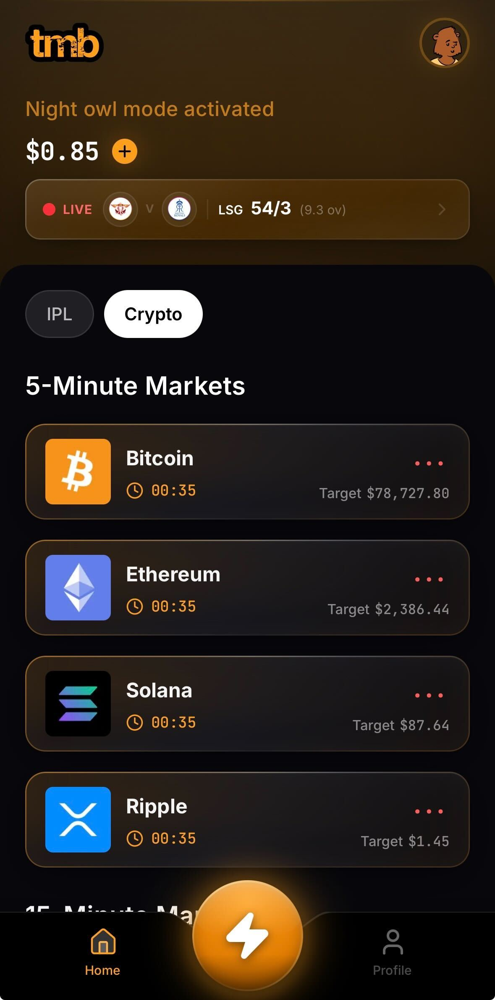
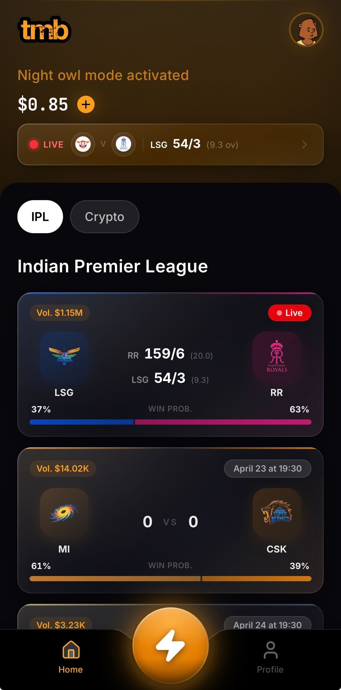
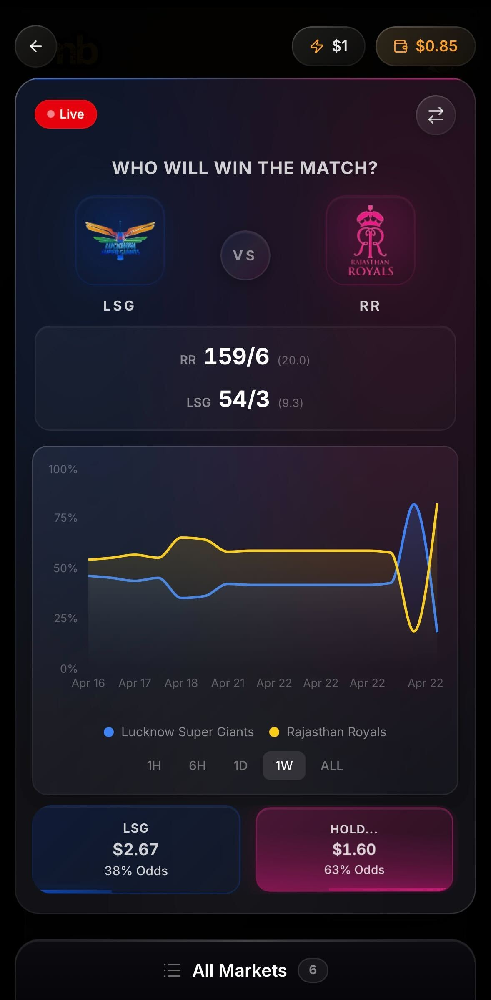
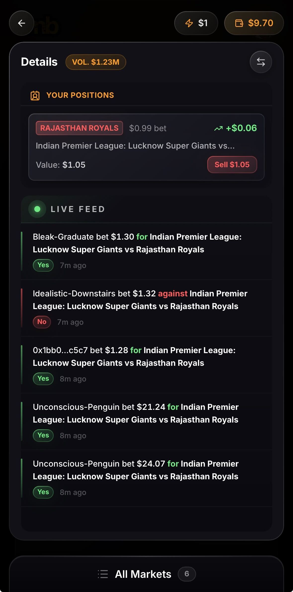

# Your First Prediction

### 1. Prerequisites

Before you make your move, ensure you’ve checked these boxes:

* ✅ Account Created: Logged in via Email, Google, or X.
* ✅ Wallet Funded: You have a USDC.e balance ([Guide](../wallet-and-funds/deposits-and-withdrawals.md)).
* ✅ Safe Setup: You’ve tapped "Continue" on the one-time wallet activation modal.

***

### 2. Find Your Edge

From the Home screen, use the category tabs to filter your focus:

* Crypto: High-velocity price predictions (5-min and 15-min intervals).
* IPL / Sports: Match outcomes and live in-game events.

Tap any card to open the Market View. Here you'll see the live price chart, the specific prediction question, and the current "Market Odds."

<figure><figcaption></figcaption></figure> <figure><figcaption></figcaption></figure>

***

### 3. Decoding the Odds & Payouts

TMB does the math for you. You don't need to calculate "share prices"-you just need to look at your Action Blocks.

#### How the Preset Works

<figure><figcaption></figcaption></figure>

At the top of your screen, you’ll see your Preset trade amount (e.g., ⚡ $1). This is your default stake. You can change this in your Settings or by tapping the icon.

#### Understanding the Action Block

Inside every Action Block (the YES/NO or Team buttons), you will see two numbers:

1. The Potential Payout (e.g., $1.60): This is the total amount you receive if you win. It is calculated as: `(Preset trade amount / Implied Probability)`.
2. The Odds (e.g., 63%): This is the market’s collective belief in that outcome.

> The TMB Math: If you have a $1 Preset and the odds are 63%, TMB buys the exact number of shares needed so that your win results in a $1.60 payout. If the odds are "Long Shots" (e.g., 10%), a $1 trade might show a $10.00 payout!

<figure><figcaption></figcaption></figure>

***

### 4. Pull the Trigger

We’ve ditched "Confirm" buttons for Action Triggers.

* The Gesture: To execute a prediction, press and hold the block for the side you’re backing.
* The Charge: A progress bar will charge up inside the block.
* The Confirmation: Once the bar completes, you’ll feel a haptic "thump." Your trade is now live.

***

### 5. Track your Positions

The moment your trade executes, the market card automatically flips to reveal your Live Position View:

* Your Stakes: See exactly how many shares you hold and their current "real-time" market value.
* The Exit: Access the Sell button if you want to lock in profits or cut losses before the timer hits zero or the match ends.

<figure><figcaption></figcaption></figure>

***

### 6. Claim Your Rewards

Once the market settles:

1. Head to your Profile tab.
2. Check the Redeem section.
3. If you won, tap Redeem to sweep your winnings directly into your Safe wallet.
